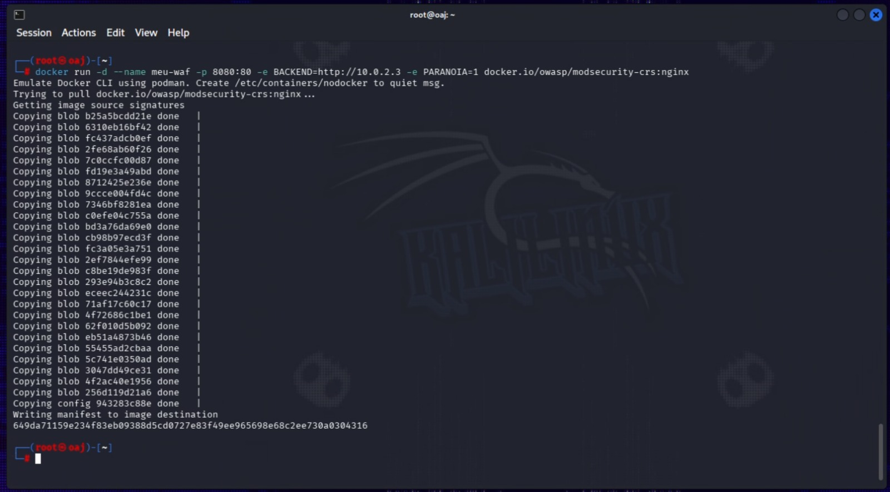

# 🛡️ Web Application Firewall (WAF) Lab - ModSecurity & OWASP CRS

Este projeto apresenta um laboratório prático de **Segurança Defensiva (Blue Team)**, focado na implementação, validação e monitoramento de um **Web Application Firewall (WAF)** para mitigar vulnerabilidades críticas descritas no **OWASP**.

O ambiente utiliza o **Nginx com ModSecurity v3** integrado ao **OWASP Core Rule Set (CRS)**, atuando como um Proxy Reverso de segurança à frente de um servidor web vulnerável (OWASP BWA).

---

## 🏗️ Arquitetura do Laboratório

O WAF foi implementado via contêiner e configurado para interceptar, inspecionar e filtrar todo o tráfego direcionado à aplicação web antes que as requisições cheguem ao servidor final.


*Figura 1: Orquestração e deploy do contêiner do WAF utilizando gerenciamento isolado.*

---

## 🧪 Testes de Validação e Eficácia (Ataque vs Defesa)

### 1. Tráfego Legítimo (Acesso Normal)
A requisição padrão ao ecossistema através do proxy reverso funciona perfeitamente, provando que o WAF opera de forma transparente para usuários comuns.


### 2. Mitigação de Directory Traversal (LFI)
Ao tentar injetar um payload para ler arquivos confidenciais do sistema operacional (`../../../../etc/passwd`), o WAF intercepta o ataque e corta a conexão imediatamente com um código de bloqueio.
```bash
curl -I "http://localhost:8080/mutillidae/index.php?page=../../../../etc/passwd"
```

*Resultado: Resposta imediata de **HTTP/1.1 403 Forbidden**.*

### 3. Mitigação de SQL Injection (SQLi)
Simulação de bypass de autenticação injetando a assinatura clássica de SQLi (`' OR 1=1 --`). O tráfego foi analisado por comportamento e barrado na borda.
```bash
curl -I -G --data-urlencode "username=' OR 1=1 --" "http://localhost:8080/mutillidae/index.php"
```

*Resultado: Resposta imediata de **HTTP/1.1 403 Forbidden**.*

---

## 📊 Análise Forense e Auditoria de Logs
Abaixo está o registro bruto gerado pelo motor de inspeção da OWASP, evidenciando a detecção exata do ataque, as regras violadas (Rule IDs) e a ação de bloqueio tomada pelo sistema.


---

## 🚀 Como Replicar este Ambiente

1. Certifique-se de ter o Docker/Podman instalado no seu ambiente de testes.
2. Inicie o WAF apontando para o IP do seu servidor alvo:
```bash
sudo podman run -d --name meu-waf -p 8080:80 -e BACKEND=http://<IP_DO_SEU_ALVO> -e PARANOIA=1 docker.io/owasp/modsecurity-crs:nginx
```
