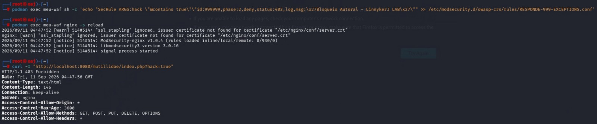

# 🛡️ Web Application Firewall (WAF) Lab - ModSecurity & OWASP CRS

Este repositório documenta a implementação de um **Web Application Firewall (WAF)** baseado em **Nginx** e **ModSecurity v3**, utilizando o conjunto de regras **OWASP Core Rule Set (CRS)**. O sistema atua como um Proxy Reverso defensivo focado na detecção e mitigação de ataques contra aplicações web.

---

## 🎯 Objetivos

O objetivo geral deste projeto é implementar e analisar um ambiente de proteção para aplicações web utilizando um WAF, avaliando sua capacidade de identificar e mitigar requisições associadas a ataques web comuns.

### Objetivos específicos:
- Implementar o ModSecurity como WAF utilizando o servidor Nginx;
- Integrar o OWASP Core Rule Set (CRS) para detecção de padrões maliciosos;
- Validar o comportamento do WAF diante de tráfego legítimo;
- Desenvolver e homologar regras de segurança customizadas (Custom Rules);
- Realizar testes controlados de ataques web em ambiente de laboratório;
- Analisar os códigos de resposta HTTP gerados pelo firewall;
- Identificar as assinaturas e regras responsáveis pelos bloqueios;
- Analisar os eventos registrados nos logs do ModSecurity.

---

## 🔬 Metodologia

O laboratório foi desenvolvido em ambiente controlado e isolado, utilizando contêineres para a execução do WAF e da aplicação web alvo (OWASP BWA). 

A abordagem seguiu três etapas principais:
1. **Validação Inicial:** Homologação do funcionamento da aplicação por meio de requisições legítimas.
2. **Customização e Simulação:** Criação de regras personalizadas de filtragem e execução de testes utilizando diferentes padrões de ataques web com base no OWASP Top 10.
3. **Auditoria de Eventos:** Avaliação dos resultados a partir dos códigos de resposta HTTP e dos eventos registrados pelo ModSecurity, comparando o comportamento esperado para cada cenário.

---

## ⚙️ 1. Arquitetura e Parâmetros de Configuração

A inteligência e o comportamento de bloqueio do WAF foram definidos diretamente na inicialização do contêiner através do ajuste de variáveis de ambiente críticas para o hardening do Nginx e ModSecurity:

* **`PORT 8080:80` (Mapeamento de Borda):** Configura o contêiner para interceptar o tráfego externo na porta `8080`, atuando como a única porta de entrada para a aplicação.
* **`PROXY_URL / BACKEND` (Direcionamento de Proxy Reverso):** Vincula o WAF diretamente ao IP interno do servidor de aplicação (`http://10.0.2.3`), garantindo que o cliente final nunca converse diretamente com o servidor web real.
* **`PARANOIA=1` (Nível de Paranoia do CRS):** Define o nível de rigor das expressões regulares do OWASP Core Rule Set. O nível `1` é o padrão recomendado para produção, mitigando ataques reais com o menor índice possível de falsos positivos.

---

## 🚀 2. Inicialização da Infraestrutura

O ambiente foi orquestrado via contêiner aplicando os parâmetros descritos na arquitetura. O console abaixo demonstra a execução do deploy, finalizando com o ID do contêiner ativo e estável:

```bash
sudo podman run -d --name meu-waf -p 8080:80 -e BACKEND=http://10.0.2.3 -e PARANOIA=1 docker.io/owasp/modsecurity-crs:nginx
```


---

## 🌐 3. Validação de Tráfego Legítimo (Acesso Normal)

Antes dos testes de segurança, validamos se o WAF permite o tráfego comum de usuários sem gerar falsos positivos. A requisição retorna o status padrão de sucesso (`200 OK`):

```bash
curl -I "http://localhost:8080/mutillidae/index.php"
```


---

## ⚔️ 4. Testes Controlados de Mitigação e Bloqueios

Com o ambiente validado, foram realizados testes controlados de ataques baseados em assinaturas globais e regras customizadas de engenharia de segurança.

### A. Detecção de Local File Inclusion (LFI / Directory Traversal)
Ao injetar um payload que simula a tentativa de leitura de arquivos confidenciais do sistema operacional, o WAF intercepta a assinatura contida no Core Rule Set e responde com código de bloqueio severo:
```bash
curl -I "http://localhost:8080/mutillidae/index.php?page=../../../../etc/passwd"
```

*Resultado: Resposta imediata de **HTTP/1.1 403 Forbidden**.*

### B. Implementação de Regra Customizada (Tuning Autoral)
Para demonstrar a capacidade de estender as regras padrão da OWASP e criar proteções sob medida para o negócio, foi desenvolvida uma regra personalizada (`id:999999`) injetada na Fase 2 do ModSecurity. A regra intercepta o parâmetro específico `hack=true` na URL e força a negação imediata:

```bash
# Injeção da regra e recarregamento do motor do WAF
sudo podman exec meu-waf sh -c 'echo "SecRule ARGS:hack \"@contains true\" \"id:999999,phase:2,deny,status:403,log,msg:\x27Bloqueio Autoral - LinnykerJ Lab\x27\"" > /etc/modsecurity.d/owasp-crs/rules/RESPONSE-999-EXCEPTIONS.conf'
sudo podman exec meu-waf nginx -s reload
```

Ao realizar o teste de requisição maliciosa utilizando o utilitário `curl`, o WAF aplica a política customizada com sucesso:
```bash
curl -I "http://localhost:8080/mutillidae/index.php?hack=true"
```

*Resultado: Resposta imediata de **HTTP/1.1 403 Forbidden** disparada por política interna.*

### C. Detecção de SQL Injection (SQLi)
Simulação de bypass de autenticação injetando operadores lógicos no parâmetro de login. O tráfego é mitigado na borda através do motor global da OWASP:
```bash
curl -I -G --data-urlencode "username=' OR 1=1 --" "http://localhost:8080/mutillidae/index.php"
```

*Resultado: Resposta imediata de **HTTP/1.1 403 Forbidden**.*

### D. Detecção de Cross-Site Scripting (XSS)
Simulação de injeção de script malicioso voltado ao cliente final utilizando tags estruturais (`<script>`). O mecanismo de inspeção profunda do ModSecurity identifica a tentativa de defacement/roubo de sessão e bloqueia a requisição de imediato:
```bash
curl -I "http://localhost:8080/mutillidae/index.php?page=<script>alert(1)</script>"
```

*Resultado: Resposta imediata de **HTTP/1.1 403 Forbidden**.*

---

## 📊 5. Análise e Auditoria de Eventos de Segurança

Por fim, inspecionamos os logs internos do console para auditar o comportamento do ModSecurity e mapear os gatilhos brutos (Rule IDs) que dispararam os bloqueios anteriores:

```bash
sudo podman logs --tail 20 meu-waf
```


---

## 📈 6. Resultados Obtidos

| Cenário Analisado | Tipo de Regra Ativada | Comportamento Esperado | Código de Resposta | Status |
| :--- | :--- | :--- | :--- | :---: |
| **Tráfego legítimo** | Nenhuma (Tráfego Livre) | Permitir requisição normalmente | `HTTP/1.1 200 OK` | ✅ Sucesso |
| **LFI / Directory Traversal** | Assinatura Global (OWASP CRS) | Interceptar e bloquear requisição | `HTTP/1.1 403 Forbidden` | 🛡️ Mitigado |
| **Regra Customizada (`hack=true`)** | Regra Personalizada (`id:999999`) | Aplicar política específica e barrar | `HTTP/1.1 403 Forbidden` | 🛡️ Mitigado |
| **SQL Injection (SQLi)** | Assinatura Global (OWASP CRS) | Interceptar e bloquear requisição | `HTTP/1.1 403 Forbidden` | 🛡️ Mitigado |
| **Cross-Site Scripting (XSS)** | Assinatura Global (OWASP CRS) | Interceptar e mitigar script injetado | `HTTP/1.1 403 Forbidden` | 🛡️ Mitigado |

---

## 🎯 7. Conclusão

A execução deste laboratório prático permitiu analisar a aplicação de uma abordagem de Defesa em Profundidade (Defense-in-Depth) na proteção de aplicações web. Embora o desenvolvimento seguro seja fundamental para a redução de vulnerabilidades, a utilização de um Web Application Firewall (WAF) fornece uma camada adicional de proteção capaz de identificar e mitigar requisições que apresentam características associadas a ataques web.

Durante os testes, foram avaliados cenários de Local File Inclusion (LFI/Directory Traversal), regras customizadas, SQL Injection (SQLi) e Cross-Site Scripting (XSS), observando-se o comportamento do WAF diante de requisições legítimas e maliciosas. Os eventos gerados pelo ModSecurity também foram analisados por meio dos logs, permitindo identificar as regras responsáveis pela detecção e pelo bloqueio das requisições.

Com o desenvolvimento do laboratório, foi possível aplicar conceitos relacionados à segurança de aplicações web, OWASP, WAF, análise de requisições HTTP e monitoramento de eventos de segurança, consolidando conhecimentos teóricos por meio de uma implementação prática em ambiente controlado.

---

> ⚡ *"Onde o código encontra o comportamento humano, a engenharia mais complexa de segurança ainda se resolve na psicologia de um único clique."*
