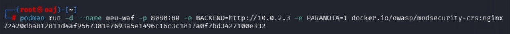
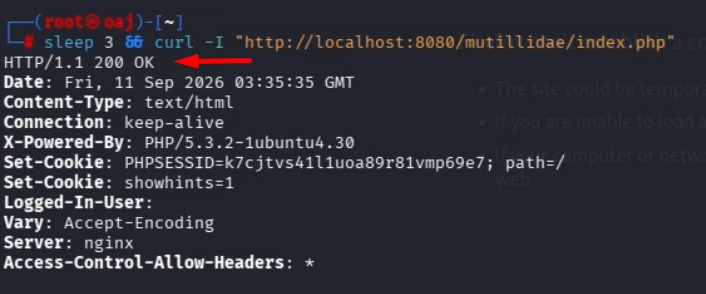
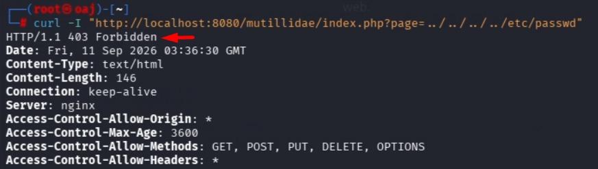
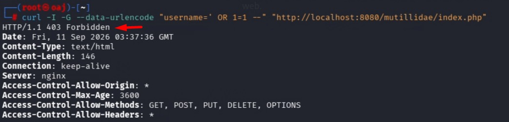
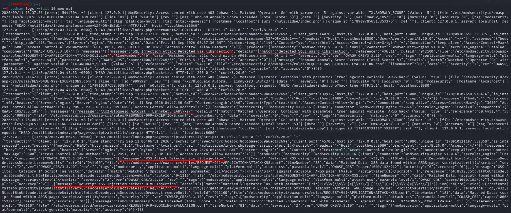

# 🛡️ Web Application Firewall (WAF) Lab - ModSecurity & OWASP CRS

Este repositório documenta a implementação de um **Web Application Firewall (WAF)** baseado em **Nginx** e **ModSecurity v3 (OWASP Core Rule Set)**, atuando como um Proxy Reverso defensivo para mitigar ataques do OWASP.

---

## 🚀 1. Inicialização da Infraestrutura

O ambiente foi orquestrado via contêiner para atuar na borda da aplicação. O console abaixo demonstra a execução limpa do deploy, finalizando com o código de sucesso (ID do contêiner ativo):

```bash
sudo podman run -d --name meu-waf -p 8080:80 -e BACKEND=http://10.0.2.3 -e PARANOIA=1 docker.io/owasp/modsecurity-crs:nginx
```


---

## 🌐 2. Validação de Tráfego Legítimo (Acesso Normal)

Antes dos testes de intrusão, validamos se o WAF permite o tráfego comum de usuários sem gerar falsos positivos. A requisição retorna um status padrão de sucesso (`200 OK`):

```bash
curl -I "http://localhost:8080/mutillidae/index.php"
```


---

## ⚔️ 3. Testes de Mitigação e Bloqueios

Com o ambiente validado, simulamos ataques reais mapeados no curso de segurança para testar a eficiência defensiva do firewall.

### A. Bloqueio de Local File Inclusion (LFI / Directory Traversal)
Tentativa de ler arquivos confidenciais do sistema operacional. O WAF intercepta a assinatura maliciosa e responde com código de bloqueio severo:
```bash
curl -I "http://localhost:8080/mutillidae/index.php?page=../../../../etc/passwd"
```

*Resultado: **HTTP/1.1 403 Forbidden***

### B. Bloqueio de SQL Injection (SQLi)
Tentativa de burlar a autenticação de login injetando operadores lógicos. O tráfego é mitigado na borda antes de alcançar o banco de dados:
```bash
curl -I -G --data-urlencode "username=' OR 1=1 --" "http://localhost:8080/mutillidae/index.php"
```

*Resultado: **HTTP/1.1 403 Forbidden***

---

## 📊 4. Análise Forense de Logs

Por fim, inspecionamos os logs internos do console para auditar o comportamento do ModSecurity e identificar as assinaturas de regras (Rule IDs) que dispararam os bloqueios anteriores:

```bash
sudo podman logs --tail 20 meu-waf
```


---

## 🎯 5. Conclusão

A execução deste laboratório prático demonstra a importância de uma abordagem de **Defesa em Profundidade (Defense-in-Depth)** na segurança de aplicações web modernas. Enquanto o desenvolvimento de código seguro deve ser sempre o objetivo principal, a implementação de um **WAF (Web Application Firewall)** robusto, como o ModSecurity com o OWASP CRS, atua como uma barreira crítica na borda contra o tráfego malicioso automatizado e explorações ativas.

Com este projeto, foi possível validar e documentar a linha completa de segurança defensiva:
* **Orquestração segura** de infraestrutura via contêineres isolados.
* **Inspeção comportamental** e mitigação imediata de payloads ofensivos em tempo real (HTTP 403).
* **Análise forense e auditoria de logs brutos** para identificação de ameaças e tomada de decisões técnicas (Blue Team).

⚡ *"Onde o código encontra o comportamento humano, a engenharia mais complexa de segurança ainda se resolve na psicologia de um único clique."*

